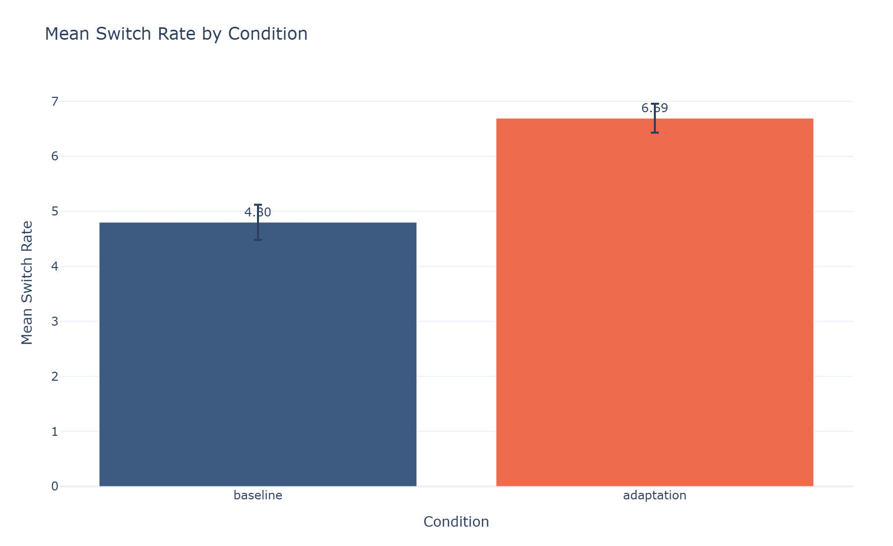
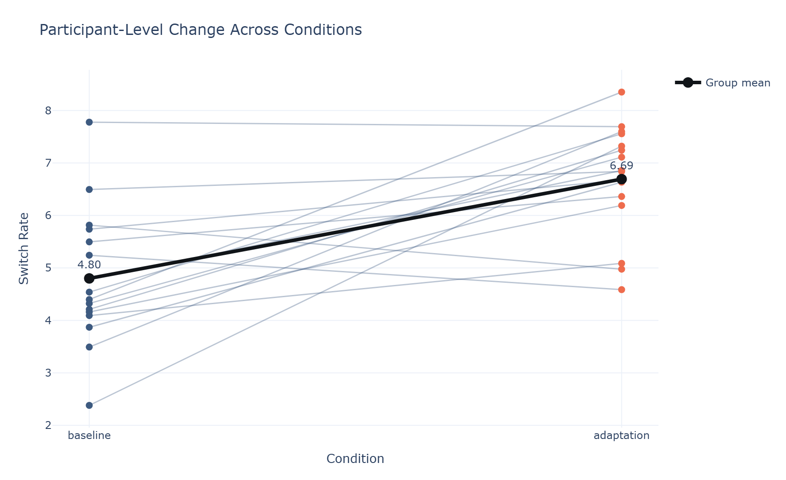

# Behavioral Data Analysis

This repository is a compact behavioral data analysis portfolio project built with simulated repeated-measures data. The notebook shows a full workflow: data generation, quality control, participant-level summaries, visualization, and inferential statistics.

## Key Plotly visuals

### 1. Mean switch rate by condition

This Plotly bar chart summarizes the condition effect with standard error bars, making the baseline vs. adaptation comparison easy to read at a glance.



### 2. Participant-level change across conditions

This paired Plotly line chart shows the within-subject pattern directly, which is often the most important behavioral-data view in a repeated-measures design.



## What this project does

- Generate a simulated behavioral dataset for `baseline` and `adaptation` conditions across multiple participants.
- Apply a simple quality-control exclusion based on minimum completed trials.
- Summarize participant-level `switch_rate` outcomes.
- Visualize the two most important behavioral patterns with Plotly.
- Run a paired `t-test` and a repeated-measures ANOVA.

## How to run

1. Create and activate a virtual environment.

```bash
python -m venv .venv
.venv\Scripts\activate
```

2. Install dependencies.

```bash
pip install -r requirements.txt
```

3. Generate the Plotly screenshots used in this README.

```bash
python generate_plotly_assets.py
```

4. Open the notebook to explore or rerun the full analysis.

```bash
jupyter notebook analysis.ipynb
```

The script writes both static PNG screenshots and interactive HTML files into `assets/`.

## Contents

| File | Description |
| --- | --- |
| `analysis.ipynb` | Main notebook for the behavioral analysis workflow, now using Plotly for the two key graphs. |
| `generate_plotly_assets.py` | Recreates the simulated dataset and exports the Plotly figures to `assets/`. |
| `requirements.txt` | Python dependencies required for the notebook and Plotly figure export. |
